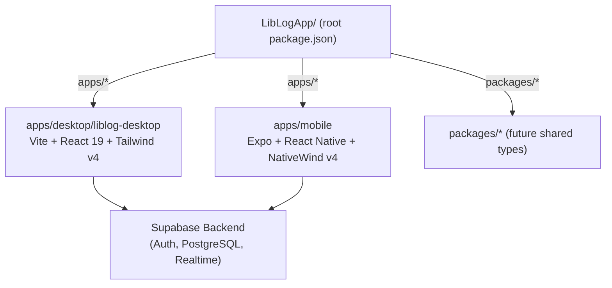
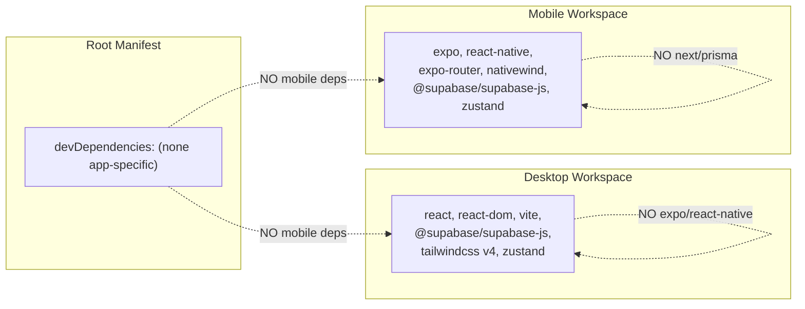
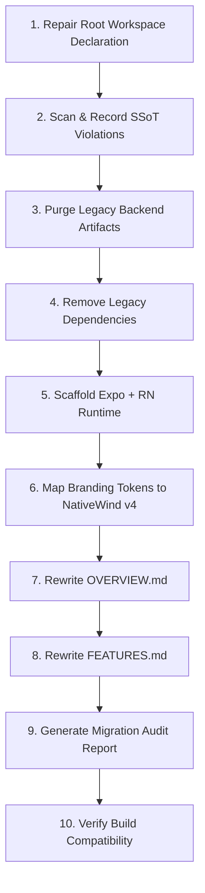

# Design Document: Mobile Monorepo Merger

## Overview

This design describes the technical approach for integrating the `apps/mobile` workspace into the LibLog NPM Workspaces monorepo. The mobile codebase is currently a Next.js 16 + Prisma + SQLite web application that must be converted into a pure Expo + React Native client, enforcing the Desktop Architecture SSoT mandate that "no backend logic is permitted in the mobile app."

The merger executes in a strict sequence: workspace repair → dependency isolation → backend purge → Expo scaffold → branding token mapping → documentation rewrite → audit report generation → build verification.

### Key Design Decisions

| Decision                                        | Rationale                                                                                                                         |
| ----------------------------------------------- | --------------------------------------------------------------------------------------------------------------------------------- |
| Purge-then-scaffold (not incremental migration) | The legacy Next.js code has no reusable React Native components; a clean scaffold is faster and eliminates hidden SSoT violations |
| NativeWind v4 for styling                       | Provides Tailwind CSS class compatibility with React Native, enabling direct reuse of branding tokens from `branding.md`          |
| `@supabase/supabase-js` as sole backend client  | Matches the Desktop_App pattern exactly; enforces SSoT by eliminating any server-side code path                                   |
| Expo Router for navigation                      | File-based routing analogous to the Desktop_App's Vite + React Router pattern; industry standard for Expo apps                    |
| Single `apps/*` glob in workspaces              | Eliminates the need to enumerate each workspace path; future workspaces auto-discover                                             |

## Architecture

### Monorepo Workspace Topology (Post-Merger)



### Dependency Isolation Model



### Migration Execution Sequence



## Components and Interfaces

### Component 1: Root Workspace Repair

**Responsibility:** Update `package.json` at workspace root to use `["apps/*", "packages/*"]` glob pattern.

**Interface:**

```typescript
// Input: Current root package.json
interface RootManifestPatch {
  workspaces: ["apps/*", "packages/*"];
  private: true;
  scripts: {
    "dev:desktop": string;
    "build:desktop": string;
    "dev:mobile": string; // new
  };
}
```

**Changes:**

- Replace `workspaces: ["apps/desktop/liblog-desktop", "packages/*"]` with `["apps/*", "packages/*"]`
- Add `"dev:mobile": "npm run start --workspace=apps/mobile"` script
- Preserve existing desktop scripts

### Component 2: SSoT Violation Scanner

**Responsibility:** Recursively scan `apps/mobile` for files that violate the Desktop SSoT before purging them.

**Interface:**

```typescript
interface SSOTViolation {
  filePath: string; // relative to apps/mobile/
  violationType: "ROUTE_HANDLER" | "FORBIDDEN_IMPORT" | "HTTP_SERVER";
  detail: string; // e.g., "exports GET from src/app/api/auth/login/route.ts"
}

interface ScanResult {
  violations: SSOTViolation[];
  legacyFiles: {
    apiRoutes: string[];
    nextConfigs: string[];
    prismaDir: string[];
    databases: string[];
    buildArtifacts: string[]; // app-paths-manifest.json
    postcssConfigs: string[];
  };
}
```

### Component 3: Backend Purge Engine

**Responsibility:** Delete all files/directories matching the Legacy_Backend_Artifacts definition.

**Purge targets (from current state):**
| Category | Glob | Current Matches |
|----------|------|-----------------|
| API Routes | `src/app/api/**` | 12 directories, ~20 route files |
| Next.js Config | `next.config.*` | `next.config.ts` (if present) |
| Prisma | `prisma/` | Schema + migrations + seed |
| Databases | `*.db`, `*.sqlite`, `*.sqlite3` | SQLite file(s) |
| Build Artifacts | `app-paths-manifest.json` | 1 file |
| PostCSS | `postcss.config.mjs` | 1 file |

### Component 4: Dependency Transformer

**Responsibility:** Rewrite `apps/mobile/package.json` to remove legacy deps and add Expo/RN deps.

**Dependencies to REMOVE (Legacy_Web_Framework_Dependencies):**

- `next`, `next-auth`, `next-intl`, `next-themes`, `eslint-config-next`
- `prisma`, `@prisma/client`, `bun-types`
- `@tailwindcss/postcss` (PostCSS not needed with NativeWind)
- All `@radix-ui/*` packages (not RN-compatible)
- `react-dom` (not used in React Native)
- `sharp`, `react-resizable-panels`, `react-syntax-highlighter` (web-only)
- `embla-carousel-react`, `cmdk`, `vaul`, `sonner` (web-only UI)
- `@mdxeditor/editor`, `react-markdown` (web-only)
- `@dnd-kit/*` (web-only drag-and-drop)
- `tailwindcss-animate`, `tw-animate-css` (replaced by NativeWind + Reanimated)

**Dependencies to ADD (Mobile_Specific_Dependencies):**

- `expo` (~52.x)
- `react-native` (~0.76.x)
- `expo-router` (~4.x)
- `expo-status-bar`
- `nativewind` (~4.x)
- `react-native-reanimated`
- `react-native-safe-area-context`
- `react-native-screens`
- `@supabase/supabase-js` (^2.x — same as desktop)
- `zustand` (^5.x — same as desktop)
- `lucide-react-native` (icon parity with desktop)
- `date-fns` (shared utility)
- `tailwindcss` (^4.x — NativeWind peer dep)

**Dependencies to RETAIN (cross-platform):**

- `react` (^19.x)
- `zod` (validation)
- `zustand` (state management)
- `@tanstack/react-query` (server cache)
- `date-fns` (date utilities)
- `react-hook-form`, `@hookform/resolvers` (forms)

### Component 5: Expo Scaffold Generator

**Responsibility:** Create the minimal Expo + React Native project structure.

**Target `apps/mobile/package.json` shape:**

```json
{
  "name": "liblog-mobile",
  "version": "1.0.0",
  "private": true,
  "main": "expo-router/entry",
  "scripts": {
    "start": "expo start",
    "android": "expo start --android",
    "ios": "expo start --ios",
    "lint": "eslint ."
  }
}
```

**Target directory structure:**

```
apps/mobile/
├── app/                    # Expo Router file-based routes
│   ├── (tabs)/
│   │   ├── _layout.tsx
│   │   ├── index.tsx       # Home
│   │   ├── search.tsx      # Catalog
│   │   ├── scan.tsx        # QR Scanner
│   │   ├── borrowed.tsx    # My Loans
│   │   └── profile.tsx     # Profile
│   ├── _layout.tsx         # Root layout (NativeWind provider)
│   └── +not-found.tsx
├── src/
│   ├── components/         # RN components
│   ├── services/
│   │   └── supabase.ts     # Supabase client (mirrors desktop pattern)
│   ├── store/
│   │   └── authStore.ts    # Zustand auth store
│   └── types/
├── tailwind.config.ts      # NativeWind v4 config with LibLog tokens
├── global.css              # NativeWind global styles
├── app.json                # Expo config
├── babel.config.js         # Babel with NativeWind preset
├── metro.config.js         # Metro bundler config for NativeWind
├── tsconfig.json
├── OVERVIEW.md
├── FEATURES.md
└── MIGRATION_AUDIT.md
```

### Component 6: Branding Token Mapper

**Responsibility:** Translate the Branding_Doc color system into NativeWind v4 configuration.

**NativeWind v4 `tailwind.config.ts`:**

```typescript
import type { Config } from "tailwindcss";

const config: Config = {
  darkMode: "class",
  content: ["./app/**/*.{ts,tsx}", "./src/**/*.{ts,tsx}"],
  theme: {
    extend: {
      colors: {
        "lib-purple": {
          DEFAULT: "#652D90",
          50: "#F5EDF9",
          100: "#E8D5F3",
          200: "#D4ADE7",
          300: "#B87DD4",
          400: "#9B5BBF",
          500: "#652D90",
          600: "#5A2880",
          700: "#4A2068",
          800: "#3A1850",
          900: "#2A1038",
        },
        background: "var(--background)",
        foreground: "var(--foreground)",
        card: {
          DEFAULT: "var(--card)",
          foreground: "var(--card-foreground)",
        },
        primary: {
          DEFAULT: "#652D90",
          foreground: "#FFFFFF",
        },
        destructive: "#DC2626",
        border: "var(--border)",
        input: "var(--input)",
        ring: "#652D90",
      },
      borderRadius: {
        "3xl": "24px",
        "2xl": "16px",
        xl: "12px",
      },
    },
  },
  plugins: [],
};

export default config;
```

**CSS Variables (`global.css`):**

```css
:root {
  --background: #f2f2fa;
  --foreground: #1a1a1a;
  --card: #ffffff;
  --card-foreground: #1a1a1a;
  --primary: #652d90;
  --primary-foreground: #ffffff;
  --border: #e8d5f3;
  --input: #e8d5f3;
}

.dark {
  --background: #110a1e;
  --foreground: #ffffff;
  --card: oklch(0.18 0.05 300);
  --card-foreground: #ffffff;
  --primary: #652d90;
  --primary-foreground: #ffffff;
  --border: rgba(255, 255, 255, 0.1);
  --input: rgba(255, 255, 255, 0.1);
}
```

### Component 7: Documentation Rewriter

**Responsibility:** Rewrite `OVERVIEW.md` and `FEATURES.md` to reflect the Mobile_App's subordinate role.

**OVERVIEW.md structure:**

1. Architectural Stance (cites SSoT doc)
2. Platform Declaration (Expo + React Native)
3. Backend Declaration (Supabase shared with Desktop)
4. Role Declaration ("data-collection client")
5. Monorepo Position (`apps/mobile` via `apps/*`)
6. Tech Stack (Expo, RN, NativeWind, Supabase, Zustand)
7. Screen Inventory (client screens only)

**FEATURES.md structure:**

1. Introduction (data-collection client / administrative engine phrases)
2. Canonical Feature Table (6+ rows with Mobile Feature, Desktop_Counterpart, Direction of Data Flow, Notes)

### Component 8: Migration Audit Report Generator

**Responsibility:** Produce `apps/mobile/MIGRATION_AUDIT.md` with all required sections.

**Sections:**

- Files Removed
- Dependencies Removed
- Dependencies Added
- Branding Tokens Mapped
- Documentation Rewritten (byte size + SHA-256)
- Outstanding SSoT Violations
- Dependency Isolation Violations
- Documentation Violations
- Install Failures (if any)
- Startup Failures (if any)
- Build Compatibility status

### Component 9: Build Verifier

**Responsibility:** Confirm both workspaces start without errors after the merger.

**Verification steps:**

1. Run `npm install` at workspace root → expect exit code 0
2. Run `npm ls --workspaces` → expect both workspace names listed
3. Start desktop dev server → expect Vite binding to port 5173 within 15s
4. Start mobile dev server → expect Expo starting within 15s
5. Record results in Migration_Audit_Report

## Data Models

### Migration Audit Report Schema

```typescript
interface MigrationAuditReport {
  filesRemoved: {
    apiRoutes: string[]; // relative paths
    nextConfigs: string[];
    prismaDir: string[];
    databases: string[];
    buildArtifacts: string[];
    postcssConfigs: string[];
  };
  dependenciesRemoved: string[];
  dependenciesAdded: string[];
  brandingTokensMapped: Array<{
    token: string;
    hex: string;
  }>;
  documentationRewritten: Array<{
    file: string;
    byteSize: number;
    sha256: string;
  }>;
  outstandingSSOTViolations: SSOTViolation[] | "None";
  dependencyIsolationViolations: string[] | "None";
  documentationViolations: string[] | "None";
  installFailures?: {
    command: string;
    exitCode: number;
    stderr: string; // first 20 lines
  };
  startupFailures?: {
    command: string;
    exitCode: number;
    stderr: string; // first 20 lines
  };
  buildCompatibility: "PASSED" | "FAILED";
}
```

### Mobile Workspace Manifest (Post-Merger)

```typescript
interface MobilePackageJson {
  name: "liblog-mobile";
  version: "1.0.0";
  private: true;
  main: "expo-router/entry";
  scripts: {
    start: "expo start";
    android: "expo start --android";
    ios: "expo start --ios";
    lint: "eslint .";
  };
  dependencies: {
    expo: string;
    "react-native": string;
    "expo-router": string;
    "expo-status-bar": string;
    nativewind: string;
    "@supabase/supabase-js": string;
    zustand: string;
    react: string;
    "react-native-reanimated": string;
    "react-native-safe-area-context": string;
    "react-native-screens": string;
    "lucide-react-native": string;
    "date-fns": string;
    zod: string;
    "@tanstack/react-query": string;
    "react-hook-form": string;
    "@hookform/resolvers": string;
    tailwindcss: string;
  };
  devDependencies: {
    typescript: string;
    "@types/react": string;
    eslint: string;
  };
}
```

### Supabase Client Configuration (Mobile)

```typescript
// apps/mobile/src/services/supabase.ts
// Mirrors desktop pattern but uses Expo Constants for env vars
import { createClient } from "@supabase/supabase-js";
import Constants from "expo-constants";

const supabaseUrl = Constants.expoConfig?.extra?.supabaseUrl;
const supabaseAnonKey = Constants.expoConfig?.extra?.supabaseAnonKey;

if (!supabaseUrl || !supabaseAnonKey) {
  throw new Error(
    "Missing Supabase Environment Variables. Check app.config.ts.",
  );
}

export const supabase = createClient(supabaseUrl, supabaseAnonKey);
```

## Correctness Properties

_A property is a characteristic or behavior that should hold true across all valid executions of a system — essentially, a formal statement about what the system should do. Properties serve as the bridge between human-readable specifications and machine-verifiable correctness guarantees._

### Property 1: Dependency Isolation Detection

_For any_ manifest object (root, desktop, or mobile) and _for any_ package name that belongs to the forbidden set for that manifest (mobile-specific deps forbidden in root/desktop; legacy web deps forbidden in mobile), the dependency isolation checker SHALL flag that package as a violation, and the violation entry SHALL include the package name, the dependency field it was found in, and the manifest file path.

**Validates: Requirements 2.4, 2.5**

### Property 2: SSoT Violation Detection

_For any_ TypeScript/JavaScript source file whose content contains a forbidden pattern (exporting a Next.js Route Handler symbol such as GET/POST/PUT/DELETE/PATCH/HEAD/OPTIONS from an API path, importing from `next/server`/`next-auth`/`@prisma/client`/`prisma`, or instantiating an HTTP server via Express/Fastify/Hono), the SSoT violation scanner SHALL classify that file as a violation and produce a violation record containing the file path and the specific offending pattern.

**Validates: Requirements 5.1, 5.2, 5.6**

### Property 3: Violation Report Completeness

_For any_ set of detected SSoT violations produced by the scanner, the Migration Audit Report generator SHALL include every violation in the "Outstanding SSoT Violations" section, such that the count of violations in the report equals the count of violations detected by the scanner.

**Validates: Requirements 5.3, 5.4**

### Property 4: File Categorization Correctness

_For any_ set of file paths removed from the Mobile_Workspace during the purge, the audit report categorizer SHALL assign each file to exactly one category (API Routes, Next.js Configs, Prisma Directory, Databases, Build Artifacts, or PostCSS Configs) based on its path pattern, and every removed file SHALL appear in the report under its correct category.

**Validates: Requirements 3.7**

## Error Handling

### Workspace Install Failures

| Error Condition                                   | Handling Strategy                                                                                                                  |
| ------------------------------------------------- | ---------------------------------------------------------------------------------------------------------------------------------- |
| `npm install` exits non-zero                      | Record command, exit code, and first 20 lines of stderr in Migration_Audit_Report under "Install Failures". Mark merger as FAILED. |
| Dependency resolution conflict between workspaces | Identify conflicting package, attempt resolution via `overrides` in root manifest. If unresolvable, report as FAILED.              |
| Network timeout during install                    | Retry once with `--prefer-offline`. If still failing, report as FAILED.                                                            |

### Purge Failures

| Error Condition                                 | Handling Strategy                                                                                                         |
| ----------------------------------------------- | ------------------------------------------------------------------------------------------------------------------------- |
| File locked / permission denied during deletion | Log the file path, skip it, and flag as "PURGE INCOMPLETE" in audit report. Merger continues but reports partial failure. |
| Directory not found (already deleted)           | Treat as success — record "(none found)" for that category.                                                               |

### Build Verification Failures

| Error Condition                              | Handling Strategy                                                                             |
| -------------------------------------------- | --------------------------------------------------------------------------------------------- |
| Desktop dev server fails to start within 15s | Record in "Startup Failures" section with command, exit code, stderr. Mark merger as FAILED.  |
| Mobile Expo server fails to start within 15s | Same as above.                                                                                |
| Port 5173 already in use                     | Attempt with `--port 5174`. If still failing, report as FAILED with note about port conflict. |

### SSoT Scanner Edge Cases

| Edge Case                                         | Handling                                                                                               |
| ------------------------------------------------- | ------------------------------------------------------------------------------------------------------ |
| File with `.ts` extension but binary content      | Skip file, log as "SKIPPED (binary)" in audit report.                                                  |
| Minified/bundled file with forbidden imports      | Still flag as violation — the scanner operates on raw text patterns.                                   |
| Dynamic imports (`import()`) of forbidden modules | Flag as violation — pattern matching catches string literals in dynamic imports.                       |
| Re-exports through barrel files                   | Scanner checks each file independently; barrel files that re-export from forbidden modules are caught. |

### Dependency Isolation Edge Cases

| Edge Case                                                                                        | Handling                                                                                                 |
| ------------------------------------------------------------------------------------------------ | -------------------------------------------------------------------------------------------------------- |
| Package appears in both `dependencies` and `devDependencies`                                     | Flag both occurrences as separate violations.                                                            |
| Package name is a substring of an allowed package (e.g., `next` vs `@tanstack/react-query-next`) | Use exact package name matching, not substring matching. Match against the key in the dependency object. |
| Scoped packages (e.g., `@next/font`)                                                             | Include in Legacy_Web_Framework_Dependencies if the scope is `@next/`.                                   |

## Testing Strategy

### Testing Approach

This feature uses a **dual testing approach**:

1. **Property-based tests** — Verify the correctness of the dependency isolation checker, SSoT violation scanner, violation report generator, and file categorizer across many generated inputs.
2. **Integration tests** — Verify the end-to-end merger pipeline (file purge, npm install, dev server startup) against the actual file system.
3. **Example-based unit tests** — Verify specific configuration values, document content, and branding token mappings.

### Property-Based Testing Configuration

- **Library:** [fast-check](https://github.com/dubzzz/fast-check) (TypeScript PBT library)
- **Minimum iterations:** 100 per property
- **Tag format:** `Feature: mobile-monorepo-merger, Property {N}: {description}`

| Property                                   | Test File                                | What It Generates                                           |
| ------------------------------------------ | ---------------------------------------- | ----------------------------------------------------------- |
| Property 1: Dependency Isolation Detection | `tests/pbt/dependency-isolation.test.ts` | Random manifest objects with injected forbidden deps        |
| Property 2: SSoT Violation Detection       | `tests/pbt/ssot-scanner.test.ts`         | Random TypeScript file contents with forbidden patterns     |
| Property 3: Violation Report Completeness  | `tests/pbt/report-completeness.test.ts`  | Random sets of violation objects                            |
| Property 4: File Categorization            | `tests/pbt/file-categorizer.test.ts`     | Random file paths matching various legacy artifact patterns |

### Integration Tests

| Test                    | Scope             | Verification                                                     |
| ----------------------- | ----------------- | ---------------------------------------------------------------- |
| Workspace install       | Root              | `npm install` exits 0, `npm ls --workspaces` lists both packages |
| Desktop build           | Desktop workspace | `npm run build --workspace=apps/desktop/liblog-desktop` exits 0  |
| Mobile start            | Mobile workspace  | `expo start` initializes without error                           |
| File purge completeness | Mobile workspace  | Glob patterns return zero matches post-purge                     |

### Example-Based Unit Tests

| Test                   | Scope               | Verification                                                          |
| ---------------------- | ------------------- | --------------------------------------------------------------------- |
| Root manifest shape    | Root package.json   | workspaces = ["apps/*", "packages/*"], private = true                 |
| Mobile manifest shape  | Mobile package.json | name = "liblog-mobile", main = "expo-router/entry", no legacy scripts |
| Branding tokens        | tailwind.config.ts  | All 10 palette shades match expected hex values                       |
| OVERVIEW content       | OVERVIEW.md         | Contains required headings, phrases, excludes forbidden terms         |
| FEATURES table         | FEATURES.md         | Has correct columns, minimum 6 rows, valid direction values           |
| Audit report structure | MIGRATION_AUDIT.md  | All required sections present with correct format                     |

### Test Execution

Tests should be run in this order:

1. Unit tests (fast, no side effects)
2. Property-based tests (medium speed, no side effects)
3. Integration tests (slow, requires file system and npm)

All tests use `vitest` as the test runner (consistent with the monorepo's TypeScript tooling).
